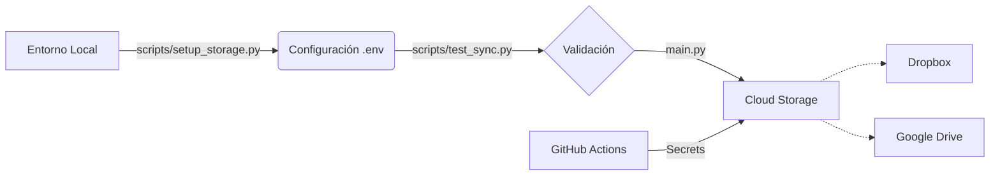

# Project-E Sync (PESync)

PESync es una herramienta de automatización en Python diseñada para gestionar la sincronización y el respaldo de componentes de emulación. El script automatiza el flujo de búsqueda, descarga y almacenamiento en la nube (Dropbox, Google Drive) de los siguientes recursos:

- **Emu**: El binario principal del entorno en formato `AppImage` para sistemas compatibles.
- **Licencias del sistema**: Archivos de configuración necesarios para la ejecución del emulador.
- **Actualizaciones del sistema**: Componentes base requeridos para la compatibilidad del emulador.

Esta herramienta está pensada para la gestión personal de respaldos y la automatización de la configuración del entorno de trabajo.



## 🚀 Características

- **Estado basado en la Nube**: El script consulta directamente el almacenamiento remoto al iniciar para determinar qué recursos ya están respaldados.
- **Límites de Versiones Configurable**: Permite definir cuántas versiones mantener de cada componente de forma independiente.
- **Rotación Automática y Auto-Limpieza**: El script identifica y elimina automáticamente versiones obsoletas en la nube para mantener solo lo más reciente según la configuración.
- **Almacenamiento Seguro**: Integración con múltiples servicios en la nube (Dropbox, Google Drive).
- **Registro y Resumen Detallado**: Implementación de un Console Logger para seguimiento en vivo y visualización de un resumen final de los componentes procesados.
- **Peticiones Seguras y Validadas**: Peticiones de red optimizadas mediante `requests`, validación robusta de activos descargables.
- **Feedback Visual (Progreso)**: Muestra barras de progreso detalladas (0-100%) en consola tanto para la descarga de archivos como para la subida a los servicios de nube (Dropbox/Google Drive).

## 📋 Requisitos Previos

- **Python 3.7+**
- Cuenta de almacenamiento en la nube (Dropbox o Google Drive) con acceso a API configurado.

### Instalación

Instala los módulos necesarios:

```bash
pip install -r requirements.txt
```

## ⚙️ Configuración

Para habilitar la sincronización remota, primero selecciona el proveedor de almacenamiento que deseas usar (Dropbox o Google Drive) y luego configura las variables de entorno necesarias.

### Seleccionar Proveedor de Almacenamiento

PESync soporta múltiples proveedores de almacenamiento. Para seleccionar cuál usar, configura la variable `STORAGE_PROVIDER`:

| Valor | Proveedor |
| :--- | :--- |
| `dropbox` | Dropbox (por defecto) |
| `googledrive` | Google Drive |

### Configuración de Credenciales (Local)

Para la ejecución en entorno local, dependiendo del proveedor seleccionado, configura las siguientes variables en tu archivo `.env`:

**Para Dropbox (`STORAGE_PROVIDER=dropbox`):**

- `DROPBOX_APP_KEY`: Llave de acceso de la API.
- `DROPBOX_APP_SECRET`: Secreto de la API.
- `DROPBOX_REFRESH_TOKEN`: Token de actualización de sesión.

**Para Google Drive (`STORAGE_PROVIDER=googledrive`):**

- `GOOGLE_DRIVE_CLIENT_ID`: ID del cliente OAuth.
- `GOOGLE_DRIVE_CLIENT_SECRET`: Secreto del cliente OAuth.
- `GOOGLE_DRIVE_REFRESH_TOKEN`: Token de actualización de sesión.
- `GOOGLE_DRIVE_FOLDER`: *(Opcional)* Nombre de la carpeta de respaldo en Google Drive. Por defecto es `PESync_Backup`.

> [!CAUTION]
> **ENTORNO LOCAL**: El archivo `.env` es **exclusivo para ejecución local**. Nunca lo subas a un repositorio público (ya está mitigado por `.gitignore`). Para entornos automatizados (como GitHub Actions), utiliza los *Secrets* del repositorio.

### Paso 1: Obtener Credenciales

Para obtener estas credenciales, ejecuta el asistente interactivo:

```bash
python scripts/setup_storage.py
```

Sigue las instrucciones en pantalla para autorizar la aplicación en tu cuenta de Dropbox o Google Drive. Al finalizar, el script intentará crear/actualizar el archivo `.env` automáticamente.

### Paso 2: Prueba de Conexión (Recomendado)

Antes de la primera ejecución o tras actualizar tus credenciales, verifica que todo funcione correctamente:

```bash
python scripts/test_sync.py
```

Este script valida que las llaves guardadas en el archivo `.env` (u obtenidas vía Secrets) sean funcionales y tengan los permisos necesarios.

### Configuración de Versiones

Puedes personalizar cuántas versiones respaldar editando el diccionario `BACKUP_CONFIG` al inicio de `src/utils/helpers.py`:

```python
BACKUP_CONFIG = {
    "emu": 2,       # Versiones del Emu
    "licenses": 2,  # Versiones de Licencias
    "system": 2     # Versiones de Firmware/Sistema
}
```

> [!NOTE]
> El script utiliza un sistema de **rotación basada en la fuente**. Si una versión ya no está entre las `N` más recientes de la fuente oficial, será eliminada automáticamente de la nube para dejar espacio a las nuevas.

### Eficiencia y Monitoreo

El sistema divide automáticamente las subidas grandes en bloques fijos de **8MB**. Este valor está optimizado para garantizar alta velocidad con la máxima fluidez en las barras de progreso, además de mantener un consumo de RAM casi nulo.

### Resumen de Uso

1. **Obtener Credenciales:** `python scripts/setup_storage.py` (creará el `.env`).
2. **Validar Conexión:** `python scripts/test_sync.py` (verificará acceso a la nube).
3. **Ejecutar Sincronización:** `python main.py`.

## 🛠 Estructura (Arquitectura Modular)

El proyecto sigue principios de Clean Code, dividiendo las responsabilidades en módulos independientes:

- `main.py`: Punto de entrada principal que orquesta la ejecución del script.
- `src/core/`: Contiene la lógica central de sincronización y procesamiento de archivos (`backup_logic.py`).
- `src/providers/`: Gestiona la integración con los proveedores de almacenamiento en la nube (Dropbox, Google Drive).
- `src/network/`: Centraliza todas las operaciones de red y descargas HTTP usando `requests`.
- `src/utils/`: Módulos de herramientas compartidas (formateo, seguridad, logging centralizado).
- `scripts/setup_storage.py`: Utilidad de configuración inicial (OAuth) para el almacenamiento en la nube.
- `scripts/test_sync.py`: Script de validación rápida de conexión y credenciales (`.env`).
- `requirements.txt`: Definición de dependencias del proyecto.
